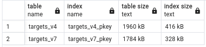

# postgre_uuid_performance

Find more details by visiting [my blog](https://equenum.github.io/posts/uuid-v4-vs-v7-in-postgre-sql/).

In light of the recent news of [native UUID v7 GUID support coming to .NET 9](https://github.com/dotnet/runtime/pull/104124), I have been deep-diving into [UUID specification](https://www.ietf.org/archive/id/draft-peabody-dispatch-new-uuid-format-04.html), as well as the pros and cons of using UUID v7 as database table primary keys.

Here, I wanted to see the specific impact of moving from UUID v4 to UUID v7 GUIDs as primary keys for one of my projects I have been working on lately - [webpage_change_monitor](https://github.com/equenum/webpage_change_monitor): a self-hosted web application for monitoring HTML changes in web pages.

## Setup

To make my tests easier I have composed this simple console application, where I set up the database access infrastructure to be almost exactly the way it is in my project, apart from minor simplifications. Here is the setup:

- .NET 8 Console application.
- EF Core + Npgsql.EntityFrameworkCore.PostgreSQL adapter.
- [UUIDNext](https://github.com/mareek/UUIDNext).
- Postgres 16.

Since Postgres 16 does not natively support UUID v7 (with support [possibly coming to Postgres 17](https://commitfest.postgresql.org/48/4388/)) I had to generate the primary keys externally in my `C#` code using [UUIDNext](https://github.com/mareek/UUIDNext): a fast and modern .NET library that generates database friendly UUIDs / GUIDs, including v7.

## Target benchmark metrics

- Sequential write performance.
- Table and index size.
- Manual table clustering performance.

## How to run

### Setup database

Find scripts [here](https://github.com/equenum/postgre_uuid_performance/tree/main/database).

```sql
-- [optional] create a schema
start transaction;

create schema if not exists monitor;

commit;

-- create a table for UUIDv4 primary keys
start transaction;

create table if not exists monitor.targets_v4 (
    id uuid primary key,
    resource_id uuid,
    display_name text not null,
    description text,
    url text not null,
    cron_schedule text not null,
    change_type text not null,
    html_tag text not null,
    selector_type text not null,
    selector_value text not null,
    expected_value text,
    created_at timestamp not null,
    updated_at timestamp
);

commit;

-- create a table for UUIDv7 primary keys
start transaction;

create table if not exists monitor.targets_v7 (
    id uuid primary key,
    resource_id uuid,
    display_name text not null,
    description text,
    url text not null,
    cron_schedule text not null,
    change_type text not null,
    html_tag text not null,
    selector_type text not null,
    selector_value text not null,
    expected_value text,
    created_at timestamp not null,
    updated_at timestamp
);

commit;
```

Here I went with B-tree for primary key indexes (default) even though better performance can be achieved with different data structures, like [BRIN](https://www.postgresql.org/docs/current/brin-intro.html) (not so simple, comes with some limitations).

### Run the code

```shell
cd PostgreConsoleApp
dotnet run
```

### Run multiple instances in Docker

```shell
cd PostgreConsoleApp

# build image
docker build -t uuid-postgres -f Dockerfile .

# spin up containers
docker run --name uuid-postgres-1 -p 5000:8080 uuid-postgres:latest
docker run --name uuid-postgres-2 -p 6000:8080 uuid-postgres:latest
```

### Measure table and index size

```sql
select
    relname as "table",
    indexrelname as "index",
    pg_size_pretty(pg_relation_size(relid)) "table size",
    pg_size_pretty(pg_relation_size(indexrelid)) "index size"
from
    pg_stat_all_indexes
where
    relname not like 'pg%';
```

### Measure table clustering execution time

```sql
CLUSTER monitor.targets_v4 USING targets_v4_pkey;
CLUSTER monitor.targets_v7 USING targets_v7_pkey;
```

## Results

### First UUID v4, then UUID v7, Run 1

- **Batches:** 11.
- **Writes per batch:** 1000x2.
- **Total writes:** 22000.

Batch execution time:

| #    | UUID v4 | UUID v7 |
| :--- | :------ | :------ |
| 2    | 8992    | 10768   |
| 3    | 11013   | 11836   |
| 4    | 11999   | 12619   |
| 5    | 13858   | 14958   |
| 6    | 15913   | 16698   |
| 7    | 17600   | 18567   |
| 8    | 19124   | 20340   |
| 9    | 21267   | 22570   |
| 10   | 23628   | 24423   |
| 11   | 25235   | 26616   |
| Avg. | 16862.9 | 17939.5 |

Table size metrics:


Table clustering execution time:

- **targets_v4_pkey:** 142 msec.
- **targets_v7_pkey:** 127 msec.

### First UUID v4, then UUID v7, Run 2

- **Batches:** 11.
- **Writes per batch:** 1000x2.
- **Total writes:** 22000.

Batch execution time:

| #    | UUID v4 | UUID v7 |
| :--- | :------ | :------ |
| 2    | 8723    | 10016   |
| 3    | 10782   | 12741   |
| 4    | 11843   | 14752   |
| 5    | 15459   | 16622   |
| 6    | 16732   | 19233   |
| 7    | 21179   | 21089   |
| 8    | 23107   | 20283   |
| 9    | 21959   | 25448   |
| 10   | 26280   | 25159   |
| 11   | 25128   | 27723   |
| Avg. | 18119.2 | 19306.6 |

Table size metrics:



Table clustering execution time:

- **targets_v4_pkey:** 121 msec.
- **targets_v7_pkey:** 96 msec.

### First UUID v4, then UUID v7, Run 3

- **Batches:** 66.
- **Writes per batch:** 1000x2.
- **Total writes:** 132000.

Batch execution time: N/A.

Table size metrics:


Table clustering execution time:

- **targets_v4_pkey:** 227 msec.
- **targets_v7_pkey:** 212 msec.

I did not compile an execution time table for for this run since I ran 6 `Docker` containers in parallel to speed up the benchmark. However, based on the logs the results for individual containers are very similar to Run 1 and Run 2.

### First UUID v7, then UUID v4, Run 1

- **Batches:** 11.
- **Writes per batch:** 1000x2.
- **Total writes:** 22000.

Batch execution time:

| #    | UUID v4 | UUID v7 |
| :--- | :------ | :------ |
| 2    | 11001   | 8733    |
| 3    | 11896   | 10533   |
| 4    | 13152   | 12747   |
| 5    | 15361   | 14393   |
| 6    | 17311   | 16850   |
| 7    | 19217   | 18208   |
| 8    | 21520   | 20115   |
| 9    | 23558   | 22071   |
| 10   | 25842   | 24381   |
| 11   | 27745   | 26825   |
| Avg. | 18660.3 | 17485.6 |

Table size metrics:


Table clustering execution time:

- **targets_v4_pkey:** 176 msec.
- **targets_v7_pkey:** 154 msec.

### First UUID v7, then UUID v4, Run 2

- **Batches:** 11.
- **Writes per batch:** 1000x2.
- **Total writes:** 22000.

Batch execution time:

| #    | UUID v4 | UUID v7 |
| :--- | :------ | :------ |
| 2    | 10191   | 8620    |
| 3    | 12222   | 11227   |
| 4    | 13521   | 12803   |
| 5    | 15768   | 15072   |
| 6    | 17885   | 17428   |
| 7    | 19179   | 18291   |
| 8    | 21236   | 20215   |
| 9    | 23324   | 23388   |
| 10   | 26530   | 24686   |
| 11   | 28273   | 26581   |
| Avg. | 18812.9 | 17831.1 |

Table size metrics:


Table clustering execution time:

- **targets_v4_pkey:** 104 msec.
- **targets_v7_pkey:** 98 msec.

## How the actual GUIDs looked like

### UUID v4 GUID


### UUID v7 GUID


